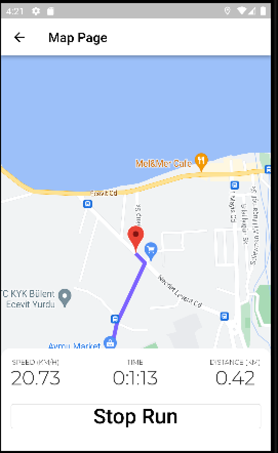
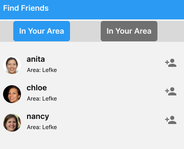

# Fit_work

A Fitness application application by Anthony Olori
Similar applications include Strava, Adidas fitness
# Features

The project follows a modular approach to track user fitness activities, each feature is a seperate system and communicates with other systems through dedicated function calls. The following features are implemented:

Run Tracker:
Tracks user's running activities, including distance, speed, and location, it uses the device GPS so it works on any modern smartphone is able to provide real time. Provides real-time feedback during the run, it also features a run distance calculator as a submodule, this takes the summary of each run session and gives the users a visual representation of their activity.
 
 

Location Tracker:
Collects and stores the user's location data for analysis and display on the map.
* It uses locaion data to track and store the users speed and distance travelled in real time.
* It uses the google maps api to display travel path as the user travels, emulating the google maps experience for easy use
 

Cloud Module: Using Firebase, the application optionally stores the user data in firestore NoSQL database, including exercise history and calculated calories, which can then be viewed by the users friendslist. 

Firebase Authentication Module: We can create individual user accounts and manage signin, from email to username and password or phone numer, user sign-in and account creation as well as Authentication is handled by this module. 

# NOTE : FOR CLONING
This application requires an API key, stored in api_key.dart. 

# Get API Key 
https://console.cloud.google.com/project/_/google/maps-apis/credentials?utm_source=Docs_Credentials

Go to the Google Maps Platform > Credentials page.

Go to the Credentials page

On the Credentials page, click Create credentials > API key.
The API key created dialog displays your newly created API key.
Click Close.

The new API key is listed on the Credentials page under API keys.
(Remember to restrict the API key before using it in production.)

