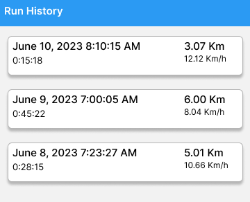

# Fit_work

A mobile application by Anthony Olori

# Features

The project follows a modular approach to track user fitness activities and provide an engaging experience. The following modules are implemented:

Run Tracker:
Tracks user's running activities, including distance, speed, and location. Provides real-time feedback during the run, it also features a run distance calculator as a submodule.
 
 

Location Tracker:
Collects and stores the user's location data for analysis and display on the map.
 

Firestore Module: Stores user data, including exercise history and calculated calories, in the cloud using Firebase Firestore.

Firebase Authentication Module: Handles user sign-in and account creation using Firebase Authentication.

# NOTE : IF YOU CLONE
This application requires an API key, stored in api_key.dart. 

# Get API Key 
https://console.cloud.google.com/project/_/google/maps-apis/credentials?utm_source=Docs_Credentials

Go to the Google Maps Platform > Credentials page.

Go to the Credentials page

On the Credentials page, click Create credentials > API key.
The API key created dialog displays your newly created API key.
Click Close.

The new API key is listed on the Credentials page under API keys.
(Remember to restrict the API key before using it in production.)

